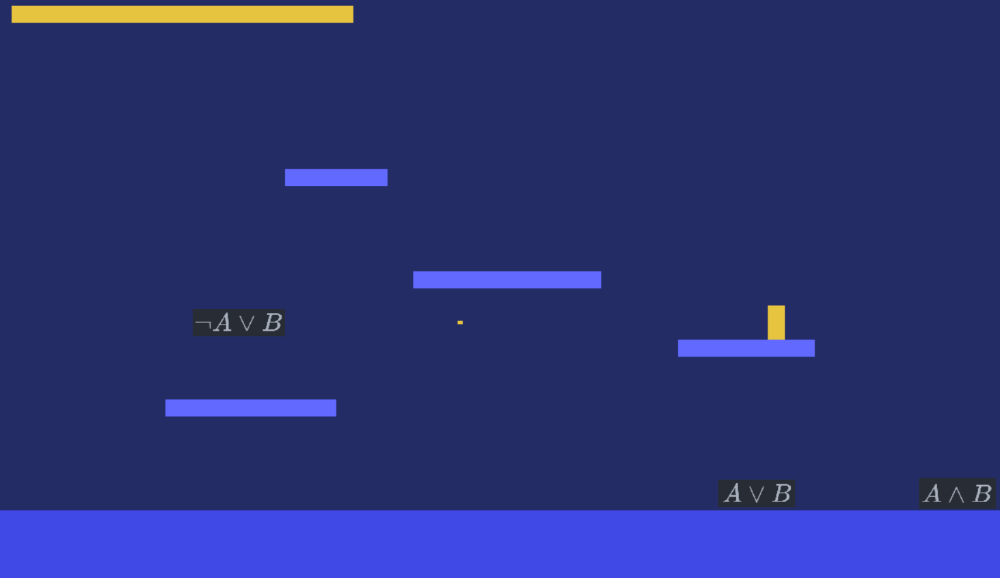

# Math Shooter

Are you tired of probability and set equations?
Well look no more! This game will help you get rid of your frustration.



The goal of this game is to shoot incoming equations before they get to the
right side of the screen.

It runs on Windows only.

## Controls

The player moves around with the directional arrows and jumps with the Up Arrow.
It can shoot bullets with the Space bar.

When an equation gets to the left side of the screen, the player's life
decreases until it reaches 0.

## Build

The project is built with Microsoft's `cl.exe` compiler.

To build it, open Visual Studio's Developer Command Prompt, go to the root
folder of the project and type this command:
```bash
cl /nologo /Zi /EHsc /W3 /WX /Iinclude src\*.cpp /link user32.lib gdi32.lib Winmm.lib /out:Math_Shooter.exe
```

> The Developer Command Prompt is usually located in
> `C:\Program Files (x86)\Microsoft Visual Studio\2019\Community`
